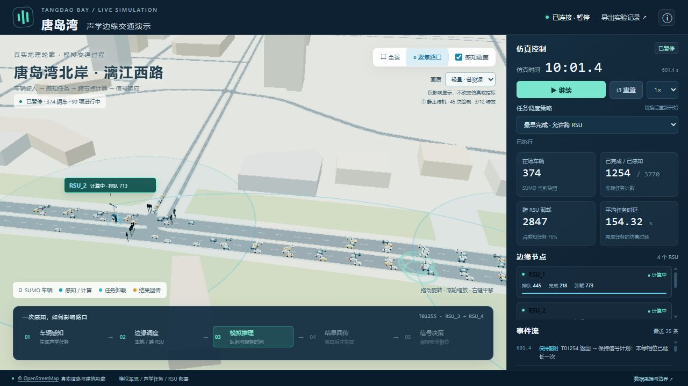
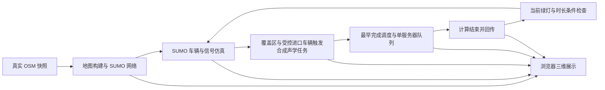

# 唐岛湾北岸声学边缘计算交通 Demo

交付版本：**1.2.0 公开便携版** · 2026 年 10 月 1 日。提供Windows x64一键准备依赖和离线便携发行包，沿用已验证的性能优化代码；不修改地图、车流、算法或统计。

在唐岛湾北岸真实 OpenStreetMap 路网与建筑轮廓上，使用 SUMO 推进车辆和交通灯，通过浏览器展示车辆经过、模拟声学感知、RSU 排队计算、跨站卸载、结果回传和有界信号响应。



这是本地运行的系统演示。车辆来自正在运行的 SUMO，动画来自后端任务记录；声学识别、RSU 部署、计算网络耗时和交通需求是明确配置的模拟内容。

系统结构、调度规则、接口、操作流程、验收结果和实施难度详见 [项目交付手册 Word 可编辑版](docs/唐岛湾声学边缘交通演示_项目交付手册_v1.2.docx)。实际页面截图和对应阶段的验证记录位于 `evidence/`。

## 下载和一键启动

**推荐：[到 Releases 下载 Windows 便携包](https://github.com/suxinstar/tangdao-bay-sumo-edge-demo/releases/latest)**，完整解压到可写目录后双击 `Start_Demo.cmd`。便携包包含 Python 和 SUMO，适合直接演示。

也可下载本仓库源码 ZIP。源码启动器先检测可用环境，缺少依赖时从官方源下载固定版本 Python 3.12.10 和 SUMO 1.25.0，校验 SHA-256 后保存到项目 `_runtime/`。首次缺少全部依赖约需下载 170 MiB，后续直接复用；无需管理员，不修改全局安装或系统显卡设置。首次在线准备需要访问 python.org 和 sumo.dlr.de。

本项目是本地 Python/SUMO 应用，GitHub 仓库用于下载与协作，不会在 GitHub 网页中直接运行三维仿真。


1. 双击 `Start_Demo.cmd`，等待浏览器打开。
2. 点击“继续”，以 1× 观察车辆进入 RSU 覆盖区后出现的任务。
3. 点击右侧某个 RSU 卡片可以聚焦该节点；“全景”查看区域地图，“聚焦路口”返回演示区域。
4. 拖动旋转视角，滚轮缩放，右键拖动平移。可关闭感知覆盖圈。
5. 暂停后查看任务流程、排队数量和事件。点击事件可以查看对应任务；右上角可以导出实际运行记录。
6. 可切换“最早完成”和“本地执行”两种策略。切换后会重置同一随机种子的仿真，指标从零开始。
7. 演示结束后双击 `Stop_Demo.cmd` 正常关闭本地服务和 SUMO。只关闭浏览器不会停止后台仿真。

默认地址为 `http://127.0.0.1:8765/`；该端口被其他应用占用时，启动器会自动尝试 8766–8775。启动日志和当前端口在 `runs/server.json`。重复启动会复用本目录已有服务。

如果同时保留多份项目，请使用各自目录的启动／停止脚本，并以本次启动器实际打开的地址为准。不要直接打开 `web/index.html`。首次启动默认暂停；重置和切换策略会开始新一轮同种子仿真。

## 地图怎么拖动

将鼠标放在三维道路或建筑区域：

| 想做什么 | 操作 |
|---|---|
| 上下左右平移地图 | 按住 **鼠标右键** 拖动 |
| 旋转方向和调整俯仰 | 按住 **鼠标左键** 拖动 |
| 放大拉近／缩小拉远 | 滚轮向上／向下 |
| 看整个区域 | 点击 **全景** |
| 恢复路口视角 | 点击 **聚焦路口** |
| 查看指定节点 | 点击右侧相应 **RSU 卡片** |

视角操作不会重置仿真。需要保存结果时，先点击右上角“导出实验记录”，再重置或切换调度策略。

## 1.1 性能修复

如果此前已在 Edge 中打开旧版，启动服务后按 **Ctrl+F5** 重新加载页面，让浏览器使用新脚本。不要仅在旧页面上点击继续。本交付沿用 1.1 性能优化基线，版本标记为 1.2.0 公开便携版。

旧版在暂停或连接中断后仍持续渲染整幅三维场景，并在每帧对所有文字标签反复写样式、读取尺寸。这会造成不必要的主线程、显卡及合成负载。优化版默认轻量显示，减少像素与实时光照成本；车辆与信号采用批量绘制，标签降低更新频率，动画受帧率上限控制，静止暂停和后台标签停止持续绘制。画质设置只作用于显示层，SUMO、调度算法、任务时间、地图和统计不变。

诊断记录位于 `evidence/performance/`。自动浏览器测量使用本机 Codex 内置 Chromium；它与用户 Edge 的实际配置不是同一个浏览器环境，因此不能把测试值直接当成 Edge 或整机的 CPU 占用率。

相同 120 秒状态快照、227 辆车、同一 Intel UHD 730、相同静止视角下的对照结果如下。旧版观测 36.68 秒，新版观测 39.32 秒；主线程忙碌比例为浏览器 `TaskDuration / 观测时长`，不是任务管理器中的整机 CPU 百分比。

| 暂停时的指标 | 旧版 | 性能修复版（默认轻量） |
|---|---:|---:|
| 页面主线程忙碌比例 | 77.00% | 0.42% |
| 观测期间新增三维绘制帧 | 3436 | 0 |
| 浏览器布局次数 | 6998 | 26 |
| 单帧绘制调用数 | 125 | 43 |

这组对照重点验证暂停后不再空转；单帧调用数来自最后一次绘制。运行中的前端固定快照测试约 22 FPS，另已用真实 SUMO 运行到 601.4 秒检查车辆、任务卸载与信号响应。前者的车辆位置固定、任务时间推进，不能代替完整动态车流性能测试。实际 Edge 全屏帧率和整机负载仍需在用户的 Edge 环境中复测。

16 项前端检查已通过，包括帧率上限、暂停/隐藏时取消帧循环、1000 任务下限制特效对象数量、重复重置资源回收和标签不读取同步尺寸。执行方式为 `node tests/frontend_performance.mjs`，使用实际前端函数和 Three.js 几何，DOM、计时器与渲染器被模拟，不属于显卡基准测试。原后端、仿真、路网、车流配置及场景数据与原始 ZIP 的 SHA-256 核对均相同，记录见 `evidence/performance/simulation_unchanged.json`。

若 Edge 仍明显卡顿，打开 `edge://gpu` 检查 WebGL/WebGL2 是否为 **Hardware accelerated**；在 `edge://settings/system` 查看“使用图形加速（如果可用）”。软件渲染会增加 CPU 负载。不要盲目修改实验性 flags 或禁用图形加速。相关依据见 [Microsoft Edge 高 CPU 或内存排查](https://learn.microsoft.com/en-us/troubleshoot/microsoft-edge/performance/edge-high-cpu-memory)。

历史性能测试使用 Intel UHD 730。硬件加速已开启也可能使用核显；较大窗口和高刷新率可能增加负载。请以本机 `edge://gpu` 的 `GL_RENDERER` 为准，不能把截图观感当作性能测量。

可选显卡设置：Windows 设置 → 系统 → 显示 → 图形 → Microsoft Edge → 高性能，重新启动 Edge 后再核对实际渲染器。此设置属于每台电脑，不随 ZIP 迁移。参考 [微软图形首选项说明](https://support.microsoft.com/en-us/windows/hardware/display-graphics/optimizations-for-windowed-games-in-windows-11)。

## 两个用户问题对应的实现

| 需求 | 本版实现 |
|---|---|
| 道路和建筑三维场景 | 真实 OSM 道路几何、建筑轮廓拉伸、海岸水面和公园 |
| 路侧设备 | 程序生成的 RSU 机柜、杆件、麦克风阵列；示意部署与比例 |
| 感知区域与声波 | 配置半径覆盖圈；任务触发时出现的事件波纹 |
| 简单任务调度 | 预计计算完成最早的 RSU；保留全部本地执行对照 |
| 计算和卸载动画 | 任务时间戳驱动的传输光点、计算状态、排队、结果回传 |
| 交通灯响应 | 已返回任务通过车道和相位条件检查后，有限延长当前绿灯 |
| 实时运行控制 | 暂停、继续、倍速、重置、策略切换、导出记录 |

## 系统设计



详细说明见 `docs/` 内的交付手册，接口字段见 `CONTRACT.md`，地图来源和重建命令见 `MAP_NOTES.md`。接口 JSON 是字段示例，实际参数以 `data/scene.json` 和运行配置为准。

调度对每个候选节点计算：开始时间为“任务传输到达时间”和“该节点最后预约完成时间”的较大者；结束时间为开始时间加服务时间。选择预计计算结束最早的节点，平手优先本地。每个 RSU 单服务器、非抢占，已经派发的计算预约不重排。

当前四个节点基础服务时间为 2.6、1.6、2.3、1.35 秒，再乘种子 42 的 0.9–1.1 随机因子。本地发送与返回各 0.04 秒；远端发送为 `0.28 + d/1600` 秒，远端返回为 `0.16 + d/2400` 秒，`d` 为节点距离（米）。这些值用于演示，不是设备测试结果，也不是物理声波传播速度。

任务结果到达后，只在对应进口当前绿灯、不含黄灯且本相位未延长时检查延长动作。每相位至多延长一次，每次至多 4 秒，延长后总绿灯不超过 55 秒；不直接跳转相位。没有触发动作的返回任务会记录“保持配时”。

## 真实地图范围

2026 年 10 月 1 日下载 OSM，首版选择漓江西路沿线四处路口：

- 太行山路：120.1830258 E，35.9432436 N。
- 井冈山路：120.1878431 E，35.9453783 N。
- 武夷山路：120.1910232 E，35.9466218 N。
- 阿里山路：120.1933284 E，35.9474456 N。

场景包括 324 条非内部道路边，连同转向连接段共 1041 条渲染道路记录；129 个建筑轮廓；26 个水域或公园区域。建筑中 10 个使用 OSM 高度，7 个按层数换算，112 个缺少高度的建筑假设为 15 米。请求下载范围与实际跨界道路范围有所区别，完整记录见 `MAP_NOTES.md`。

地图数据：© OpenStreetMap contributors，采用 [ODbL 1.0](https://opendatacommons.org/licenses/odbl/1-0/)；[署名与版权说明](https://www.openstreetmap.org/copyright)。原始快照和可复建脚本随包交付。Three.js 0.180.0 采用 MIT 许可，文件及许可证已包含在本地。

## 已执行的验证

- 地图交通场景单独运行 600 仿真秒：1171 辆插入、817 辆到达、0 碰撞、0 传送。
- 调度与信号逻辑 5 项单元检查通过，覆盖单节点串行服务、卸载、返回前禁止控制及绿灯约束。
- 真实 SUMO 后端两种策略各运行 120 秒，均产生任务和信号响应；同种子重置后任务、事件和指标完全一致。
- 公共 HTTP 接口运行至 100 秒以上，检查暂停时钟、任务各阶段、卸载、信号响应、导出；启动复用、正常停止、重启均检查通过。
- 浏览器画面与控件验证记录见 `evidence/acceptance.json`，后端详细结果见 `verification/backend_verification.json`。

在当前 120 秒的合成负载下，最早完成策略有 382 项感知任务，205 项已回传、296 项跨站派发，完成任务平均时延约 11.97 秒；本地策略完成 189 项，平均时延约 13.41 秒。尚未回传任务分别为 177 和 193 项，不能把已完成任务的均值当作完整任务总体的研究比较。两种策略的交通指标在本次检查中相同，本版没有证明改善真实交通效率。

## 环境与可复建性

运行依赖为 Python 3.10+、SUMO 和支持 WebGL 的浏览器。便携包包含已验证运行时；源码首次启动自动准备缺失依赖。现有安装也可由 SUMO_HOME 和 TANGDAO_PYTHON 指定。Three.js 已随包包含，运行时不依赖 CDN、在线地图瓦片或 API 密钥。

```powershell
python server.py --host 127.0.0.1 --port 8765
python -m unittest discover -s tests -v
python tests/verify_backend.py
python scripts/build_map.py --verify
```

地图构建默认复用原始OSM快照，但会重新生成派生文件。主动添加 `--download` 才重新下载OSM；更新可能改变道路和信号 ID，应重新联调。

注意：`build_map.py --verify` 会先重建网络、场景与路线，再运行 600 秒 SUMO，并非只读检查。本次交付采用现有快照的只读哈希、结构和连接一致性核对，未执行该重建命令。前端开发检查可运行 `node tests/frontend_performance.mjs`；普通运行不需要 Node.js。

## 本次交付补充说明

- 新版手册：`docs/唐岛湾声学边缘交通演示_项目交付手册_v1.2.docx`。
- Windows 启动器 20 项检查通过，含中文及空格目录迁移、包内运行时、真实 SUMO 启动／暂停／继续／停止、端口复用和下载完整性检查，详见 `evidence/delivery/launcher_validation.json`。
- 本次交付回归：`evidence/delivery/validation.json`；前端16项、后端5项和地图只读检查通过。
- 打包时的完整运行档案：`evidence/delivery/current_run_export.json`。这是只读快照，不是恢复仿真进度的检查点；启动交付包会开始新一轮。
- 用户运行数据保存在本地 `runs/`，不会自动上传；发布包排除旧进程文件与开发缓存。若从浏览器后退缓存返回或图形上下文丢失后不再同步，可用 Ctrl+F5 重新加载。
- 601.4秒检查中感知3770项、完成1254项，尚有2516项未回传，完成任务平均时延154.32秒，表明合成负载下存在队列积压；不能将本演示称为稳定低时延系统。
- `delivery_manifest.json` 提供每个文件的 SHA-256。运行 `python scripts/verify_package.py` 可只读核对完整性。

本项目直接使用 SUMO/TraCI，新增合成任务与三维展示；真实声学识别分支尚未实现。

## 启动器高级参数

```powershell
# 只准备依赖，不启动仿真
.\Start_Demo.ps1 -PrepareOnly
# 强制使用项目内的便携依赖
.\Start_Demo.ps1 -PortableOnly
# 启动服务但暂不打开浏览器
.\Start_Demo.ps1 -NoBrowser
```

`_runtime/` 是可重建的本地依赖缓存，`runs/` 是本地运行结果。两者均由 `.gitignore` 排除。若下载被网络阻断，可改用Release离线便携包。第三方来源和许可见 `THIRD_PARTY_NOTICES.txt`。
