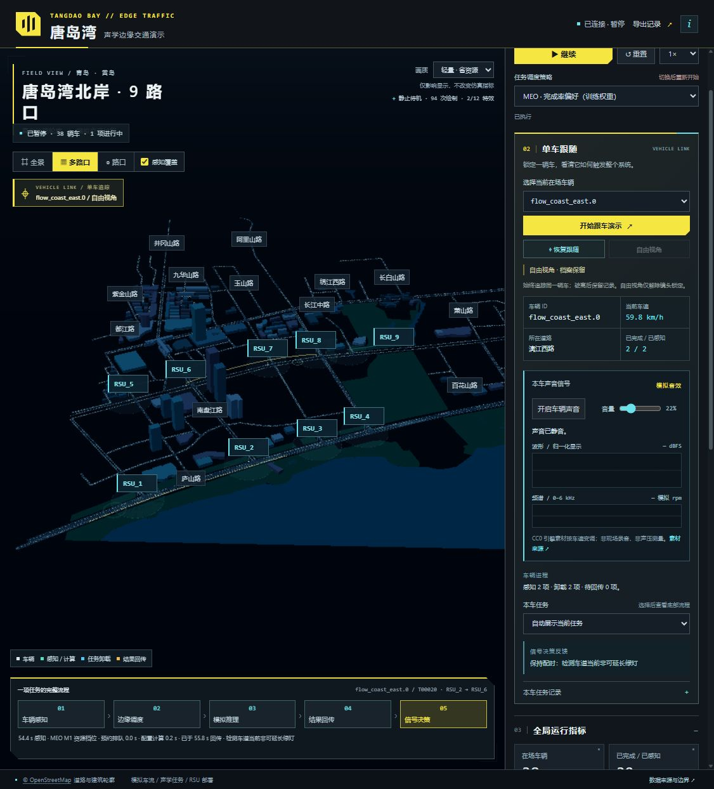
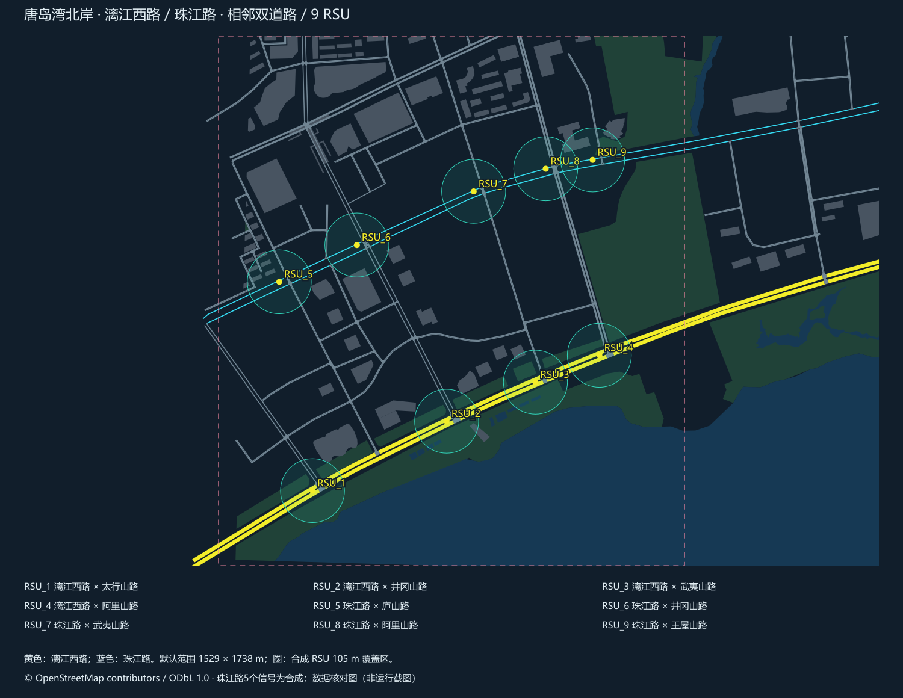

# 唐岛湾北岸声学边缘交通 Demo

版本 **1.5.0 · MEO 训练策略与相邻双道路版**（2026 年 10 月 8 日）。在真实 OpenStreetMap 路网上运行 SUMO，通过三维 HUD 展示车辆经过、模拟声学感知、RSU 调度计算、跨站卸载、结果回传和有界绿灯响应。



道路与建筑轮廓来自真实 OSM；车辆位置和交通灯状态来自正在运行的 SUMO。交通需求、RSU 部署、播放音效、声学感知、计算与链路耗时仍是演示配置。声音波形不代表唐岛湾现场录音，真实模型接口不代表已有训练精度。

## 一键启动

1. 完整解压 **Windows_x64 便携包**到可写目录，双击 `Start_Demo.cmd`。便携包含 Python 3.12.10、SUMO 1.25.0、NumPy 1.26.4、两份 MEO actor 权重和声音素材，普通运行不需要 Node.js、在线地图或 API 密钥。
2. 若使用源码包，启动器会检测已有环境；缺少依赖时从 Python、SUMO 官方源及 NumPy 的 PyPI 官方发布下载固定版本并校验 SHA-256，保存到项目 `_runtime/`，不修改系统安装。
3. 浏览器打开后默认暂停。点击右侧 **开始跟车演示**：继续仿真并锁定一辆车。也可以先从下拉列表选择车辆，或单击地图中的车辆。
4. 在 **本车声音信号** 中点击 **开启车辆声音**。浏览器要求一次用户点击；默认音量 22%，可以静音或调节音量。
5. 演示结束后双击 `Stop_Demo.cmd`。仅关闭网页不会停止后台 SUMO；本地运行记录保存在 `runs/`。

默认地址 `http://127.0.0.1:8765/`。端口被占用时启动器尝试 8766–8775，实际地址保存在 `runs/server.json`。重复启动会复用同目录服务。更新旧版时先运行 `Stop_Demo.cmd`，再运行 `Start_Demo.cmd`，网页按 **Ctrl+F5**；只刷新网页不会更换已在运行的后端代码和地图。

GitHub 仓库为 [suxinstar/tangdao-bay-sumo-edge-demo](https://github.com/suxinstar/tangdao-bay-sumo-edge-demo)。[v1.5.0 发行页](https://github.com/suxinstar/tangdao-bay-sumo-edge-demo/releases/tag/v1.5.0)提供源码包和 Windows 离线包。旧发行附件保留。网页仓库本身不执行本地仿真。

## MEO 任务调度

默认 **MEO · 完成率偏好（训练权重）**，可切换 **MEO · 精度偏好**、最早完成规则或纯本地。策略使用用户算法包中两份真实专家 actor，决定本地/卸载/丢弃、执行节点和 M1–M5 资源档位；不以规则伪装学习策略。模型档位会改变模拟计算耗时，丢弃任务不占队列、不回传、不触发信号。

运行时只需轻量 NumPy CPU 推理，无需 PyTorch/CUDA；限制计算线程以控制 CPU 开销。完整结构、输入适配、原始 checkpoint 哈希、复现步骤与限制见 [MEO_SCHEDULER.md](docs/MEO_SCHEDULER.md)。M1–M5 是原算法的模拟声学资源/精度画像，本项目并未执行五个声学模型，也不声称新道路上的精度或调度收益已经得到验证。

## 声音、跟车与完整流程

- **始终跟随同一辆车**，允许旋转和缩放。黄色箭头、圆环与最近最多 120 个采样点的轨迹标记目标。
- 播放随 SUMO 车速变调的 CC0 引擎循环，怠速和行驶速度对应不同音高与增益。当前所有车辆使用同一引擎素材模型，不表示车型识别或真实转速估计。
- 波形和频谱读取实际播放链路的 `AnalyserNode`。波形采用归一化显示便于观察；dBFS 是播放数字信号幅度，不能视为校准声压级。频谱展示 0–6 kHz。
- 暂停、自由视角、隐藏网页、车辆驶离、连接中断、重置或关闭时停声；恢复跟随后，取得有效状态才继续。刷新网页后需重新点击开启声音。
- 底部展示该车一项任务的 **感知 → 调度 → 排队与计算 → 回传 → 信号决策**。右侧保留本车全部任务与事件，可指定历史任务或切回自动展示。
- 车辆驶离后不自动换车，保留最后位置、完整任务和后续回传结果。只有完成并回传的任务满足控制条件时才延长绿灯；“保持配时”同样是有效结果。

音源为 domasx2 的 [racing car engine sound loops](https://opengameart.org/content/racing-car-engine-sound-loops)，CC0 1.0。素材已随包保存，播放不访问该网站。许可原文、原始链接、SHA-256 与技术边界详见 [声音来源说明](docs/AUDIO_SOURCES.md)。

## 地图范围与操作

当前配置 **9 个路口、9 个 RSU**：RSU 1–4 位于漓江西路，RSU 5–9 位于相邻的珠江路；由真实南北道路连通。三组对应路口距离约 625–650 米，原漓江—长江平均约 1095 米，现平均约 639 米，缩短 41.6%。珠江路的信号设备和配时为明确标注的 SUMO 合成设置。

完整 OSM 导入路网仍保留；默认“多路口”视图聚焦这两条相邻道路。准确范围、节点坐标与道路来源见 `data/scene.json` 及 `MAP_NOTES.md`。

| 操作 | 结果 |
|---|---|
| 左键拖动 | 旋转地图；短按车辆可选车 |
| 右键拖动 | 平移地图 |
| 鼠标滚轮 | 拉近或拉远 |
| 多路口 | 展示九个感知路口的联动区域，默认视图 |
| 全景 | 展示完整导入路网 |
| 路口 / 右侧 RSU 卡片 | 聚焦一个路口或设备 |
| 自由视角 | 解除镜头锁定并停声，保留本车档案 |
| 恢复跟随 | 再次跟随当前仍在场的车辆 |



详细地理范围、投影、交通流与重建命令见 [MAP_NOTES.md](MAP_NOTES.md)。地图采用 ODbL 1.0，© OpenStreetMap contributors；建筑缺失高度使用示意值，RSU 位置和市政配时均非实测。

## 真实模型接入位置

已提供实际可调用的模块与样例，不只是预留文字说明：

| 后续工作 | 当前代码位置 / 契约 | 当前边界 |
|---|---|---|
| 真实音频、阵列采集与同步 | `integration/providers.py` 的 `AudioFrame` | 传入音频引用、采样率、通道、时间、设备；采集驱动尚未实现 |
| 分类、方位和定位模型 | `PerceptionProvider`、`PerceptionResult`、`http_acoustic.py` | 提供标签、置信度、方位、坐标和不确定度字段；无训练权重 |
| 推理与远程服务 | `integration/gateway.py`、`example_probe.py` | 后台有界队列、HTTP 超时、错误和旧运行结果隔离 |
| 真实算力与链路时延 | `ComputeProvider`、`TransportProvider` | 默认使用合成时长，可替换为实测估计 |
| 新调度算法 | `SchedulerProvider.select()` | 主仿真已调用默认最早完成策略；可实现其他策略 |
| 信控策略和执行器 | `SignalPolicy`、`SignalActuator` | 当前只调用本地 SUMO；实体信号机明确拒绝执行 |

通过 `--model-endpoint` 配置独立 HTTP 推理服务后，可以向 `/api/model/probe` 提交音频引用。默认不访问任何外部模型。真实推理结果先做 **shadow 旁路评估**，不会直接替换演示任务或进入信号控制。训练、真实音频采集、时间同步、定位到车道、识别误差处理以及真实闭环验证，仍需后续提供模型和实测数据。

完整接口、实际运行命令、替换步骤和未实现项目详见 [MODEL_INTEGRATION.md](docs/MODEL_INTEGRATION.md)。自检命令：

```powershell
& .\_runtime\python-3.12.10\python.exe -m integration.example_probe
```

## 跟车性能优化

- 车辆由 10 组模型合并为 **2 组批量绘制**，每车只计算一份位置矩阵；只上传相机视野内车辆及跟随目标，完整 SUMO 车辆与统计仍保留。
- 轻量模式上限 24 FPS、渲染缓冲最多 **90 万像素**；标准模式上限 30 FPS、最多 180 万像素。高分辨率屏幕不再按完整物理像素绘制三维场景，界面文字保持正常分辨率。持续重帧会自动进一步降低渲染分辨率。
- 声音仅一个 AudioContext，最多一个主播放源和短暂淡出的旧源；波形/频谱与主画面共享调度，最高 12.5 FPS，不另建持续动画循环。
- 跟车使用 `/api/state?vehicle=...`，一次取得同一时刻全局状态与车辆档案，替代每轮双请求；500 ms 轮询，暂停降频，隐藏页停止轮询和绘制。
- 后端使用待完成任务索引、到期堆和入口车道索引；信号每步读取一次；暂停状态复用 JSON 缓存。不会随着已完成任务积累反复扫描全部历史任务。
- 帧率、实际渲染车辆数、车辆批次数、帧 CPU 用时、分辨率和真实 GPU 渲染器在右上角 **性能诊断** 查看。浏览器后退缓存恢复时重新初始化已释放的场景。

**历史 v1.4 性能参考（不是 v1.5 复测）**：本机带音频的真实移动跟车观测 64.42 秒、1396 帧，平均约 **21.7 FPS**，页面主线程忙碌比例约 **8.87%**，末帧显示 9/103 辆车、2 个车辆批次。测试条件为内置 Chromium、Intel UHD 730、1920×1080、轻量模式；车速从 59.3 到 56.9 km/h，中间包含信号停车。该数值不是 Edge、整机 CPU 占用率或所有硬件的承诺，也不是与旧场景严格同负载的 A/B 提升百分比。证据：[live_follow_audio_1920.json](evidence/v1_4_20261008/live_follow_audio_1920.json)。

## 验证与复现

本版证据在 `evidence/v1_5_20261008/`，地图证据在 `evidence/adjacent_roads_20261008/`。两专家各完成 600 秒实际 SUMO 闭环：9/9 站均产生任务；任务预约无重叠，回传后才检查信号，0 碰撞、0 传送。最新逐策略统计与输入哈希见 [meo_sumo_integration.json](evidence/v1_5_20261008/meo_sumo_integration.json)。两策略在当前输入上的动作均为卸载，未人为改成混合动作来美化演示；丢弃分支由有针对性的生命周期测试验证。

独立路网运行（不含任务闭环信控）600 秒：280 辆插入、184 辆到达、峰值 110，9/9 路口有车流，0 碰撞、0 传送。该结果与学习策略闭环属于不同控制条件。

可复现检查（在项目根目录）：

```powershell
& .\_runtime\python-3.12.10\python.exe -m unittest discover -s tests -p "test_*.py" -v
& .\_runtime\python-3.12.10\python.exe tests/verify_meo_journey.py
# 以下是开发检查，普通演示无需 Node.js
node tests/frontend_performance.mjs
node tests/vehicle_follow.mjs
node --test tests/vehicle_audio.mjs
```

Python 56 项测试、车辆跟随 26 项检查、性能逻辑 16 项检查、音频 18 项测试通过。两专家的原 Torch/NumPy actor 在 104 个图输入、21,840 个动作头 argmax 对照中完全一致；额外独立当前地图复核见 `independent_review.json`。Windows PowerShell 5 便携启动验证覆盖中文空格路径、离线依赖、默认训练模型、重复启动复用、暂停和停止。

这些检查分别验证推理一致性、应用逻辑和可运行性，不构成真实声学精度、新地图优越性或所有电脑帧率保证。

## 文件与历史记录

- `web/`：Three.js、HUD、车辆音效与前端控制。
- `server.py`、`simulation.py`：HTTP 与真实 SUMO/TraCI 步进；`integration/`：模型适配。
- `data/`、`scenario/`：原始 OSM、来源清单、派生三维地图、九路口交通场景。
- `CONTRACT.md`：接口字段与数据边界；`docs/`：模型、音频说明和历史手册。
- `delivery_manifest.json`：文件 SHA-256，打包后用下方便携命令核对。
- `runs/`：本机实际运行数据，打包与 Git 排除；`qa/`：临时开发验证，同样排除。

随附 Word v1.2 手册和 `evidence/cyberpunk_20261008/`、`evidence/performance/`、`verification/` 是历史版本设计/测量，原样保留供追溯，不代表本版九路口的当前实验结果。旧 `tests/verify_vehicle_journey.py` 固定了四路口车辆ID，原九路口基线检查仍可使用 `tests/verify_expanded_journey.py`；学习策略验收使用 `tests/verify_meo_journey.py`。旧文档生成脚本只用于历史交付材料，本版操作与统计以本 README 和 v1.5 证据为准。

在项目根目录核对交付文件或重建地图：

```powershell
& .\_runtime\python-3.12.10\python.exe scripts/verify_package.py
# 以下重建会修改地图和路线，先运行 Stop_Demo.cmd 停止服务
$env:SUMO_HOME = (Resolve-Path '.\_runtime\sumo-1.25.0').Path
$env:PATH = (Join-Path $env:SUMO_HOME 'bin') + ';' + $env:PATH
& .\_runtime\python-3.12.10\python.exe scripts/build_map.py --verify
```

默认复用原 OSM；主动传入 `--download` 才下载新快照。信号每绿相位最多延长一次、每次最多4秒、总绿灯最多55秒；本版没有证明真实识别精度或真实交通改善幅度。
